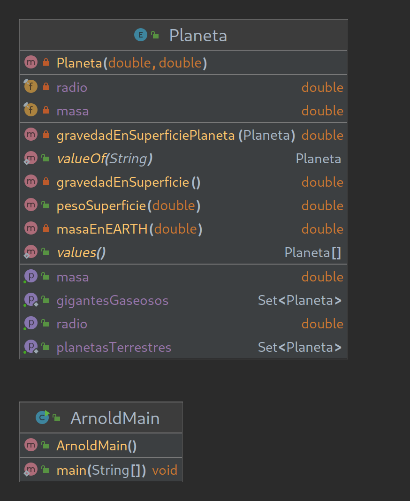

# Arnold Enum Type

## Arnold's Mistake. Kata Programación DAW Dual.
Arnold necesita tu ayuda para calcular su peso en los distintos planetas del sistema solar.  
Crea el programa con la ayuda del diagrama UML.  

Arnold needs your help to calculate it's weight in the different planets of the solar system.
Create the program with the help of the UML diagram.  

## Key-Concepts :dart: 
- Enums
- Singleton
- Total Recall
- AssertJ
- Wait, where is pluto?

## UML
